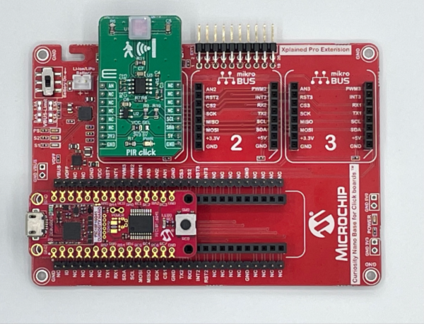
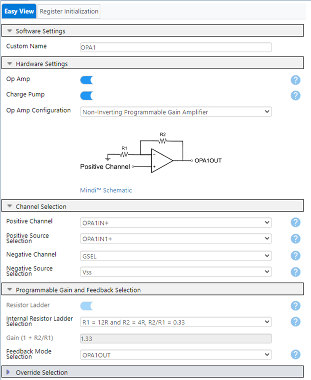
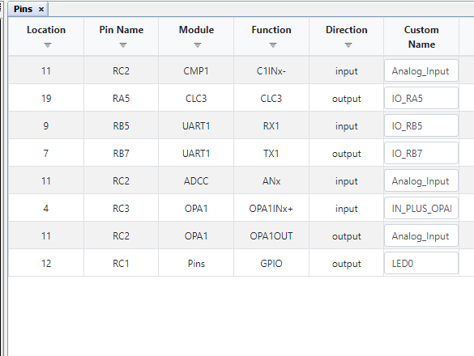

<!-- Please do not change this logo with link -->

[](https://www.microchip.com)

# Detecting people with a PIR sensor on the PIC18F16Q41 Microcontroller

In this application, a PIR Click Board™ from MikroElektronika (MikroE) is used alongside the PIC18F16Q41 on the Curiosity Nano development board. When a person is detected, the LED is triggered by the microcontroller. Additionally, a message will also be sent to MPLAB Data Visualizer serial terminal to indicate when a person has been detected or not. This demonstration displays the capabilities of the Core Independent Peripherals (CIPs) on the PIC18F16Q41.

## Related Documentation

* [PIC18F16Q41 Datasheet](https://ww1.microchip.com/downloads/en/DeviceDoc/PIC18F06-16Q41-DataSheet-40002214C.pdf)
* [PIC18F16Q41 Device Page](https://www.microchip.com/en-us/product/PIC18F16Q41?utm_source=GitHub&utm_medium=TextLink&utm_campaign=MCU8_MMTCha_pic18q41&utm_content=pic1816q41-person-detector-mplab-mcc)
* [PIC18F16Q41 Curiosity Nano Users Guide](https://ww1.microchip.com/downloads/en/DeviceDoc/PIC18F16Q41-Curiosity-Nano-Hardware-User-Guide-DS50003048A.pdf)
* [MPLAB Data Visualizer Plugin or other serial terminal](https://www.microchip.com/en-us/tools-resources/debug/mplab-data-visualizer?utm_source=GitHub&utm_medium=TextLink&utm_campaign=MCU8_MMTCha_pic18q41&utm_content=pic1816q41-person-detector-mplab-mcc)

## Software Used

* [MPLAB® X IDE v6.0.0](https://www.microchip.com/en-us/tools-resources/develop/mplab-x-ide?utm_source=GitHub&utm_medium=TextLink&utm_campaign=MCU8_MMTCha_pic18q41&utm_content=pic1816q41-person-detector-mplab-mcc)
* [MPLAB Code Configurator (MCC)](https://www.microchip.com/en-us/tools-resources/configure/mplab-code-configurator?utm_source=GitHub&utm_medium=TextLink&utm_campaign=MCU8_MMTCha_pic18q41&utm_content=pic1816q41-person-detector-mplab-mcc)
  * Melody Library v5.1.4 (or later)
* [MPLAB XC8 Compiler v2.36](https://www.microchip.com/en-us/tools-resources/develop/mplab-xc-compilers?utm_source=GitHub&utm_medium=TextLink&utm_campaign=MCU8_MMTCha_pic18q41&utm_content=pic1816q41-person-detector-mplab-mcc)

## Hardware Used

* [PIC18F16Q41 Curiosity Nano (EV26Q64A)](https://www.microchip.com/en-us/development-tool/EV26Q64A?utm_source=GitHub&utm_medium=TextLink&utm_campaign=MCU8_MMTCha_pic18q41&utm_content=pic1816q41-person-detector-mplab-mcc)
* [Curiosity Nano Base for Click Boards (AC164162)](https://www.microchip.com/en-us/development-tool/AC164162?utm_source=GitHub&utm_medium=TextLink&utm_campaign=MCU8_MMTCha_pic18q41&utm_content=pic1816q41-person-detector-mplab-mcc)
* [MikroE PIR Click Board (MIKROE-3339)](https://www.mikroe.com/pir-click)

## How does it work?

The PIR Click board uses an Passive InfraRed (PIR) sensor that detects the heat signature of a warm-blooded animal compared to the background temperature in the area that the sensor is facing. The PIR click generates an analog voltage of approximately 2V for a positive detection and 0V for no detection. Signal conditioning of this raw analog signal is required to reject any interference from fluorescent light sources, and to sufficiently amplify the signal to make full use of the resolution of the Analog to Digital Converter (ADC) peripheral.  


  


## Demo Overview

The required signal conditioning for the analog signal from the PIR sensor is done using CIPs, which includes the operational amplifier (OPA), Analog to Digital Converter with Computation (ADCC), Digital to Analog Converter (DAC), Configurable Logic Cells (CLC) and Timer 4 (TMR4). The CLCs and TMR4 significantly reduce the software overhead to filter out noise, as all of the signal conditioning is done in hardware.

The image below shows the CIPs and their interconnections.  


### Operational Amplifier (OPA)

The Operational Amplifier (OPA) is used to amplify the raw analog input coming from the PIR click. The raw analog output must be amplified to utilize the full resolution of the ADCC. Using MPLAB Code Configurator (MCC), the OPA module was configured as a Non-Inverting Programmable Gain Amplifier with a gain of 1.3.    

The configuration of the OPA will be shown in the Setup Section.

### Comparator (CMP)

The CMP is used to indicate whether presence has been detected or not. With DAC2 and the amplified PIR Click analog output connected to the comparator, the comparator will produce either a digital output, that is used to determine whether a person has been detected or not. The DAC2 peripheral generates a voltage to establish the CMP threshold.

Analog sensors, such as the sensor used on the PIR Click, have some amount of electrical noise, which can cause false triggers. To rectify this issue, the comparator's internal hysteresis setting was used to help generate stable switching behavior.

Configuration of the CMP will be shown in the Setup Section.

### Configurable Logic Cell (CLC)

The drift of the PIR Click analog output over time may lead to false triggers. Additionally, the use of the sensor under fluorescent lights introduces noise into the signal path. The introduced noise can lead to false triggers. This can be mitigated by using a Timer peripheral coupled with CLC peripherals. TMR4, CLC1, CLC2 and CLC3 peripherals were used together to construct a software-less digital filter to resolve this issue.

Configuration of TMR4, CLC1, CLC2 and CLC3 will be shown in the Setup Section.

*Curiosity Nano Base for Click Boards with PIR Click*


## Setup


### Step #1: Creating the Project

* On the toolbar, click on New Project
* Microchip Embedded; Standalone Project
* Enter the Device
  * For this Project: PIC18F16Q41
* Enter a name for this project, such as *pic18f16q41*-*person-detector*
  * Name: “*pic18f16q41*-*person-detector*”
  * **Note: The project name cannot have any empty spaces**

### Step #2: MPLAB Code Configurator (MCC)

  * Open MCC by clicking the blue "MCC shield in the top toolbar
  * Set Configuration Bits. Can be accessed under "system" in the Resource Management(MCC) tab
    * See below image for configuration bits


* Modify the Clock Control
  * See below image for Configuration Bits. Can be accessed under "system" in the Resource Management (MCC) tab


### Step #3: Adding the Peripherals

**Operational Amplifier (OPA)**

* In Device Resources:
  * Drivers &rarr; OPAMP &rarr; OPA1
  * Once the peripheral is added, modify the peripheral to match the below image.


  

**Analog-to-Digital-Converter (ADCC)**

*Note: The ADCC will measure and print the detected values.*

* In Device Resources:
  * Drivers &rarr; ADCC &rarr; ADCC
  * Once the peripheral is added, modify the peripheral to match the setup in the image below.

  

**Digital-to-Analog-Converter (DAC)**

* In Device Resources:
  * Drivers &rarr; DAC &rarr; DAC2
  * Once the peripheral is added, modify the peripheral to match the image below.

  

**Comparator (CMP)**

* In Device Resources:
  * Drivers → Comparator → CMP1
  * Once the peripheral is added, modify the peripheral to match the image below.


**Timer (TMR)**

* In Device Resources:
  * Drivers &rarr; Timer &rarr; TMR4
  * Once the peripheral is added, modify the peripheral to match the image below.


**Configurable Logic Cell (CLC)**

* In Device Resources:
  * Drivers &rarr; CLC &rarr; CLC1, CLC2, and CLC3
  * Once the peripheral is added, modify the peripherals to match the images below
     * *Note: CLC1, CLC2 and CLC3 will all use the "2-input D flip-flop with R" Logic Cell Mode*  

* CLC1


* CLC2


* CLC3


**Timer 2 (TMR2)**

*Note: TMR2 will determine how fast the onboard LED is blinking when presence is detected*

* In Device Resources:
  * Drivers &rarr; TMR &rarr; TMR2
  * Once the peripheral is added, modify the peripheral to match the image below.

  

**Universal Asynchronous Receiver-Transmitter (UART)**

*Note: UART is used to send a to be displayed to MPLAB Data Visualizer indicating whether motion has been detected or not.*

* In Device Resources:
  * Drivers &rarr; UART &rarr; UART1
  * Ensure to enable Redirect STDIO to UART, Enable Recieve, and Enable Transmit in UART1PLIB.
  * Once the peripheral is added, modify the peripheral to match the images below.


  

### Step #4: Configuring the Pins

This code example's signal connections are summarized in the following table


*Note: Please note that the PIR Click is used on mikroBUS™ socket #1 on the Curiosity Nano development board. If a different socket is being used, be sure to change the respective pins.*


|Signal|Pin Selection|
| :-: | :-: |
|PIR Click Raw Analog Output|RC3|
|OPA Inverting Input (OPA1INx-)|No connection needed|
|OPA Non- Inverting Input (OPA1INx+)|RC3|
|OPA Output (OPA1OUT)|RC2|
|ADCC Output(ANx)|RC2|
|Comparator Positive Input (C1IN1+)|No connection needed|
|Comparator Negative Input (C1IN1-)|RC2|
|CLC3 Output|RA5|
|LED0|RC1|
|UART TX|RB7|  

**Pin Renaming:**

* Rename Pin RC1 to: LED0
* Rename Pins RC2 (CMP1), RC2 (ADCC), and RC2 (OPA1) to Analog_Input

  

**Pin Allocation Table:**

  

### Step #5: Generate the project

- Click the generate button in MCC to create the appropriate header and source files for this configuration.

### Step #6: Modifying main.c

- Upon the generation being completed, the new MCC generated header and source files will be in the project window. Select the main.c file and you will see an empty while(1) loop where you can add your application code.  

```   
int main(void) {
        SYSTEM_Initialize();
        adc_result_t result;
        DAC2_SetOutput(208);   // This is the threshold value needed in order to obtain the most optimum sensitivity on the PIR sensor
        bool var = 0;

   while (1) {

        result = ADCC_GetSingleConversion(Analog_Input);
        bool CLCRead = CLC3_OutputStatusGet();
        if (CLCRead) {
            if  (var != 0) {
            printf("Person Undetected \n\r");
            LED0_SetHigh();
            var = 0;
            }  
          }  
        else  if (!CLCRead) {
            if(var == 0) {
            printf("Person Detected \n\r");
            // printf("Result: %d \n\r", result);  // to print the detected ADC value, uncomment this line of code.
            }
          if (T2CONbits.ON == 0) {
            LED0_Toggle();
            T2CONbits.ON = 1;
            }
         var = 1;
          }
       }
     }

```

* Make and Program the Device  

### Step #7: MPLAB Data Visualizer

- For this project, the terminal program that is being used is MPLAB Data Visualizer
  - Open Data Visualizer by clicking the green “DV” shield in the top toolbar
- Click on your Curiosity Nano COM port and set:
  - Baud Rate to: 19200
  - Char Length: 8 bits
  - Parity: None
  - Stop Bits: 1 bit
- Click “Apply” to save these settings
- On the right side of the terminal window, ensure “Display As: 8-bit ASCII” is selected
- Press the drop-down carrot next to your Curiosity Nano’s COM port and select “Send to Terminal”
- If everything is set up correctly, then the Data Visualizer should start displaying whether presence has been detected or not.
- If you wave your hand in front of the sensor, you will notice the terminal emulator displaying a message.

## Operation

  

## Summary

This demo has shown how to implement a PIR sensor using the CIP's on the PIC18F16Q41.
